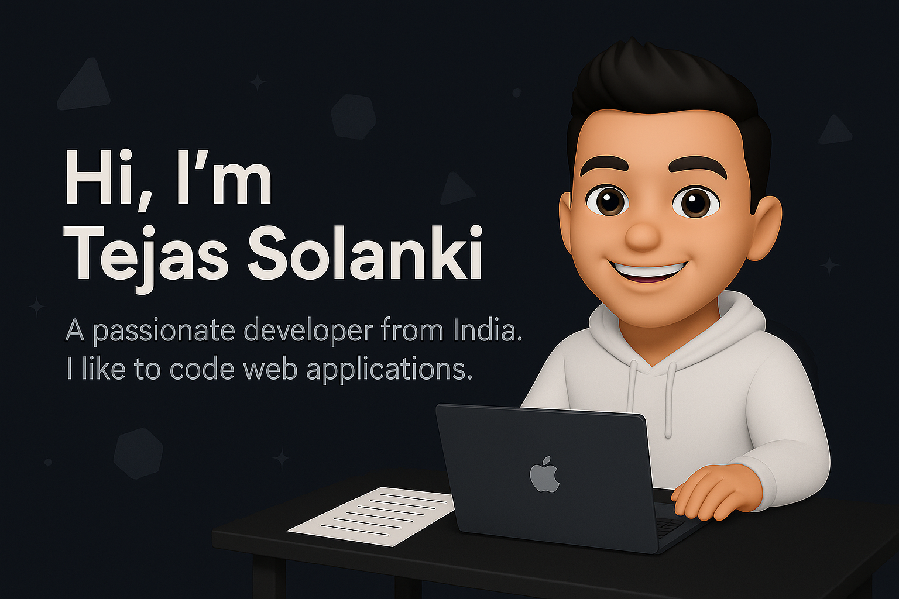

- 📫 How to reach me **2024.stejas@isu.ac.in**

<h3 align="left">Connect with me:</h3>

---

<h3 align="center">💻 Tech Stack</h3>

  <!-- Languages -->
  
  
  
  
  
  
  
  

  <!-- Dev Tools -->
  
  
  
  
  

  <!-- UI/UX & Design -->
  
  
  
  

  <!-- Backend & Database -->
  
  
  
  

---

---

